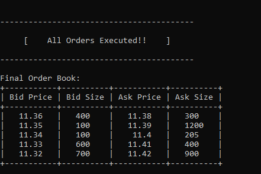

# StockX
Limit Order Book(Trading) in python. Maintains both buy side and sell side of Order.  Implemented Market Order, Limit Order and Stop Order.

## SetUp
1. Requirements:
```python
pip install -r requirements.txt
```
2. Open CMD in root folder and Run:
```python
py main.py
```

## Features
* Supports Market Order, Limit Order and Stop Order
* Easy setup by setup walk through:
    - Un-comment line after #Run next ? (ln 117 - 119 @ main.py)
    ```
    _next = input("Do you want to continue? (Y/N): ")
        if(_next == 'N' or _next == 'n'):
            break
    ```
* To pass data CSV
    - Un comment and pass user defined file path. (ln 48 @ main.py)
    ```
    csv_data = app.extract_csv()
    -or-
    csv_data = app.extract_csv(file_path)
    ```

## Symbols Usage CSV Format

* bid:

    `B,<symbol>,<exchange>,<quantity>,<price>,<timestamp>,<id>`

* ask:

    `A,<symbol>,<exchange>,<quantity>,<price>,<timestamp>,<id>`

1. Market Order:

    `<type>,<symbol>,<exchange>,<quantity>,<>,<timestamp>,<id>`

2. Limit Order

	`<type>,<symbol>,<exchange>,<quantity>,<price>,<timestamp>,<id>`	

3. Stop Loss

    `<type>,<symbol>,<exchange>,<quantity>,<price>,<timestamp>,<id><trigger_price>`

## Note
Currently using:
1. Type 
* A: Ask or Sell
* B: Bid or Buy

2. Quantity / Size

3. Price

4. Trigger Price

5. Exchange 

## Output


## Future Scope
1. Using Symbol for trading in specific stock.
2. Using timestamp differentiating for Active Market and after market close.